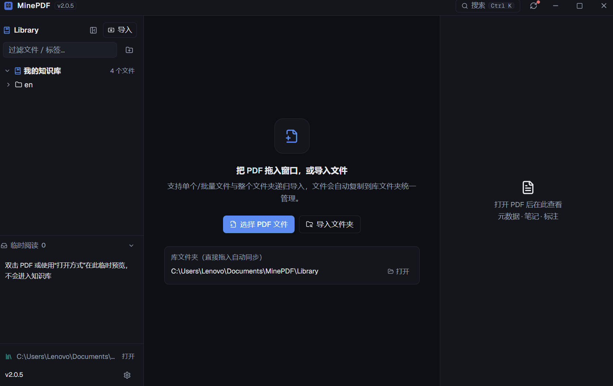
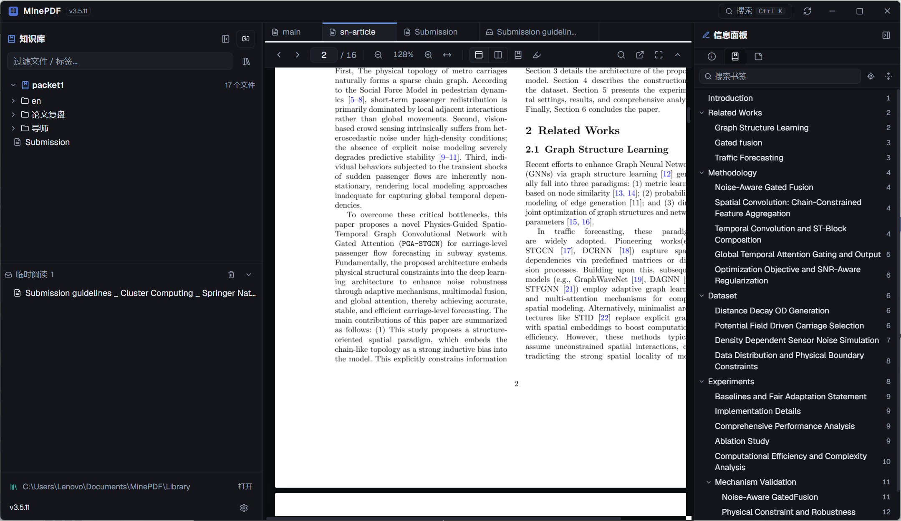
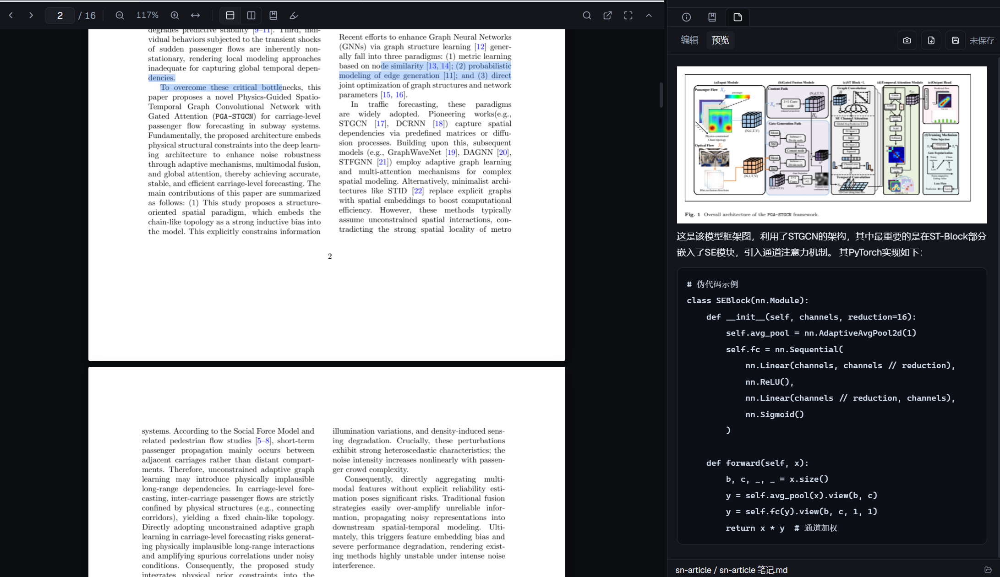

# MinePDF

本地优先的「个人 PDF 知识库」桌面应用，形态类似 Obsidian，专注于 PDF 的管理、阅读、标注与笔记。

技术栈：Electron + React + TypeScript + Tailwind CSS + PDFium + PDF.js + SQLite。

## 界面预览

### 简洁界面

深色科研风格三栏布局：左侧文件库、中间阅读器、右侧信息面板，干净高效。



### 功能丰富

文件夹树与本地目录双向同步、标签筛选、书签跳转、高亮标注、全局搜索、临时阅读区、自动更新，一应俱全。



### 图文笔记

Markdown 笔记支持截图插入，图文并茂边读边记，并可直接导出为 PDF。



## 核心功能

- **PDF 文件库**：文件夹树与 `Documents/MinePDF/Library` 真实目录严格双向同步，本地增删改即时反映；右键直达系统资源管理器
- **PDF 阅读（2.0.0 全新渲染引擎）**：PDFium 原生 C++ 渲染像素（速度快、无尖峰），PDF.js 保留文本层与交互；支持单页/双页、缩放、页码跳转、Ctrl+F 搜索、Ctrl+滚轮缩放（分屏各屏独立）、抓手拖动、沉浸式阅读
- **网页式文档页签与分屏（3.1.0）**：顶部只保留应用栏，文档以网页式标签页管理（打开即替换当前标签，右键可新建标签/分屏）；分屏为独立的阅读屏，每个屏拥有自己的标签栏与完整阅读功能，分隔线可拖拽调整大小，屏内标签全部关闭后自动消失
- **阅读体验（3.2.0）**：知识库自动折叠开关——阅读 PDF 时左侧自动收起，鼠标移到左边缘临时展开切换文件，保留手动折叠按钮
- **书签面板增强（3.0.0）**：书签搜索、定位当前章节、标题折叠/一键展开
- **图标化工具栏（3.0.0）**：功能键统一图标 + 悬停提示，界面更简洁
- **书签 / 标签 / 笔记**：内置书签跳转；#标签 筛选；Markdown 笔记（格式/段落、LaTeX、自动/手动保存、导出 PDF、选区截图插入笔记）
- **高亮标注**：选词整块高亮、添加备注，数据存 SQLite，重新打开自动恢复
- **临时阅读区**：设为默认 PDF 应用后，双击任意 PDF 临时预览，不进入知识库
- **全局搜索**：文件名、标签、笔记内容
- **自动更新**：内置更新源（国内镜像加速），启动自动检查，一键下载安装

## 安装与运行

无需开发环境，直接下载安装包：

- `release/MinePDF Setup x.x.x.exe` — Windows 安装程序
- `release/MinePDF x.x.x Portable.exe` — 绿色便携版

开发环境运行（Node.js 18+）：

```bash
npm install
npm run dev
```

## 构建与打包

```bash
npm run build    # 生产构建（自动下载 PDFium 运行时）
npm run dist     # 生成安装版 + 便携版到 release/
```

国内网络打包前设置镜像：

```powershell
$env:ELECTRON_MIRROR='https://npmmirror.com/mirrors/electron/'
$env:ELECTRON_BUILDER_BINARIES_MIRROR='https://npmmirror.com/mirrors/electron-builder-binaries/'
npm run dist
```

## 发布更新

打 tag 即自动构建发布（GitHub Actions 生成 Release 并更新 Pages 上的 update.json）：

```bash
git tag v3.2.1
git push origin v3.2.1
```

## 数据目录

```
Documents/MinePDF/
├── Library/             # PDF 库（与软件文件夹树同步）
└── data/
    ├── database.sqlite  # 数据库
    ├── notes/           # 每篇笔记一个文件夹（md + 截图 assets）
    ├── annotations/     # 标注镜像
    ├── config/          # 设置
    └── backups/
```

## License

MIT
