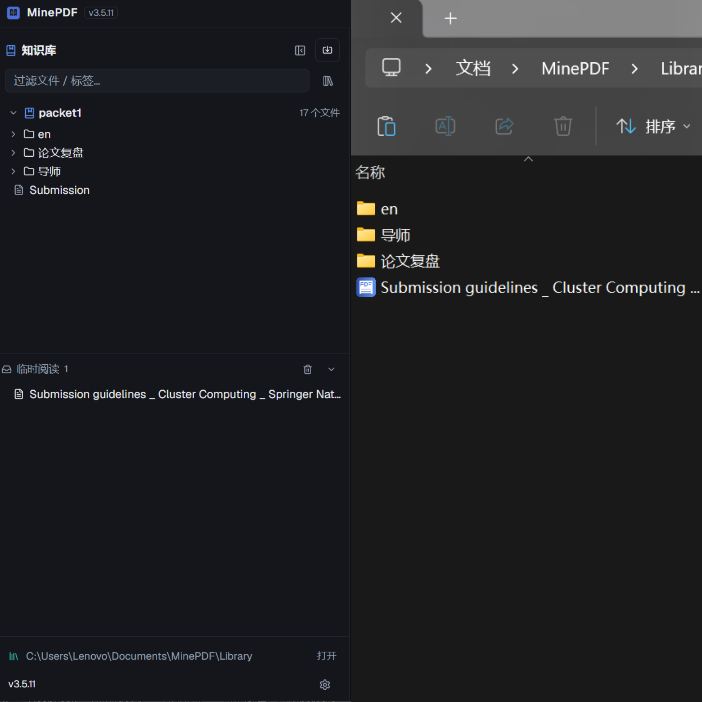

<div align="center">
  

  <h1 align="center">MinePDF</h1>

  <p align="center">Windows 桌面的「个人 PDF 知识库」——把论文、教材与技术文档收进井井有条的知识库</p>

  <p align="center">
    
    
    
    
    
    
  </p>
</div>

---

MinePDF 是一款 Windows 桌面的「个人 PDF 知识库」应用。它把所有精力都放在 PDF 上：把散落在本地的论文、教材、技术文档收进统一的知识库，按领域分区存放、按主题分类管理，配合阅读、标注、笔记与全文检索，变成一套真正属于你自己的 PDF 知识系统。

## 立即下载 Windows 安装包

| 下载入口 | 推荐人群 | 链接 |
| --- | --- | --- |
| 夸克网盘 | 夸克用户，国内高速下载 | [下载 MinePDF 3.5.11](https://pan.quark.cn/s/e47e6518b10e?pwd=gPC3)（提取码 `gPC3`） |
| 百度网盘 | 百度网盘用户 | [下载 MinePDF 3.5.11](https://pan.baidu.com/s/1WPaNtfWMBdNngaYDPcKhAQ?pwd=m7m2)（提取码 `m7m2`） |
| GitHub Release | GitHub 用户、版本说明与源码 | [下载 MinePDF 3.5.11](https://github.com/myp-super/MinePDF/releases/tag/v3.5.11) |

安装时只需要下载并运行 `MinePDF Setup 3.5.11.exe`，或直接运行 `MinePDF 3.5.11 Portable.exe` 绿色便携版（免安装、不写入系统）。

不要把 `.blockmap`、`latest.yml` 或 `win-unpacked` 目录当成正式安装包。

> 已安装旧版本的用户，也可以直接在软件内「检查更新」一键下载安装最新版，无需手动替换。

## 下载或安装被拦截怎么办

Electron 桌面软件、未签名安装包有时会被浏览器、Windows Defender 或 SmartScreen 提示风险。请先确认安装包来自上方 GitHub Release，文件名是 `MinePDF Setup 3.5.11.exe`。

1. 浏览器下载栏提示风险时，打开下载列表，点击该下载右侧的 `...`，选择「保留」/「仍要保留」。
2. Windows SmartScreen 弹出蓝色拦截窗口时，点击「更多信息」，再点「仍要运行」。
3. 如果杀毒软件明确提示木马、高危或已隔离，不要强行运行；删除该文件后重新从官方 Release 下载，仍然异常请带截图反馈。

## 当前版本

当前版本：`3.5.11`

状态：MinePDF 3.5.11 正式版。

## 界面预览

<div align="center">
  
  
  
</div>

知识库管理（左）：本地存储，分区管理，快捷高效　·　界面简洁（中）：三栏布局一目了然　·　图文笔记（右）：笔记功能，边读边记，支持插入代码、公式、导出等

## 核心特性

- **多知识库分区管理**：像书架一样整理 PDF——按领域分知识库、按主题建文件夹、按标签做索引。每个知识库是独立分区，对应 `Documents/MinePDF/Library/<知识库名>` 真实目录，「深度学习」「控制理论」「嵌入式」「论文」各建一个库，互不混放；库内支持多级子文件夹，如「论文 / 2026 / Transformer」，层层归类，结构完全由你定义
- **严格双向同步**：软件里的知识库与本地目录实时一致——本地新建、重命名、移动、删除文件或文件夹，软件树立即同步；在软件里操作，本地目录同样即时更新。知识库中的每个 PDF 都是真实文件，可直接在资源管理器中拖入、整理，也能从软件右键直达系统资源管理器，两个入口管理都不会乱
- **PDF 快速渲染**：PDFium 原生 C++ 渲染（速度快、无模糊），PDF.js 保留文本层与交互；大文件虚拟滚动，首帧秒出
- **网页式标签页与分屏**：文档以网页式标签管理，打开即替换当前标签、右键可新建标签或分屏；分屏为独立阅读屏，各有自己的标签栏、缩放、书签与临时区，分隔线可拖拽
- **沉浸式阅读**：一键最大化并收起左右边栏，工具栏随鼠标滑出，专注阅读
- **书签精确定位**：点击书签跳转到对应章节起始位置，任意缩放比例下都精确贴合阅读区顶部；书签支持搜索、定位当前章节、标题折叠与一键展开
- **标签交叉索引**：一个 PDF 只能放在一个文件夹里，但可以打多个标签。跨分类找资料时不用翻目录，点一下 `#标签`，所有相关 PDF 立即汇总
- **Markdown 笔记**：格式、段落、LaTeX 公式、代码块、自动保存、区域截图插入笔记、导出 PDF；每篇笔记一个文件夹（md + 截图资源）
- **高亮与标注**：选词整块高亮、添加备注，数据存入 SQLite，重新打开自动恢复
- **临时阅读区**：可设为系统默认 PDF 应用，双击任意 PDF 临时预览，不进入知识库；临时阅读同样支持书签、笔记与标注
- **全局搜索**：文件名、标签、笔记内容
- **自动更新**：内置更新源（含国内镜像加速），启动自动检查，一键下载安装

## 使用说明

Windows 用户可直接下载上方安装包，或运行便携版。安装包会创建桌面快捷方式。

- **导入 PDF**：拖拽 PDF 到软件窗口、点击导入按钮、或批量导入文件夹；导入时通过目录树选择目标位置
- **数据位置**：所有数据保存在 `Documents/MinePDF/`，无需开发环境
- **已安装旧版本**：直接运行 `MinePDF Setup 3.5.11.exe` 完成覆盖更新，或软件内检查更新

## 开发运行

需要 Node.js 18+：

```bash
npm install
npm run dev
```

## 构建与打包

```bash
npm run build    # 生产构建（自动下载 PDFium 运行时）
npm run dist     # 生成安装包 + 便携版到 release/
```

国内网络打包前配置镜像：

```powershell
$env:ELECTRON_MIRROR='https://npmmirror.com/mirrors/electron/'
$env:ELECTRON_BUILDER_BINARIES_MIRROR='https://npmmirror.com/mirrors/electron-builder-binaries/'
npm run dist
```

## 更新机制

MinePDF 通过 GitHub Pages 上的 `update.json` 检测新版本。远端版本高于本地版本时，软件内更新入口会展示版本说明，并自动下载安装包完成更新（支持国内镜像加速，断点续传）。本地验证更新链路时，可在设置中填写自定义 update.json 地址来模拟线上版本。

## 数据目录

```
Documents/MinePDF/
├── Library/             # PDF 库（每个知识库一个一级目录，与软件树同步）
│   ├── 我的知识库/
│   └── 其他知识库/
└── data/
    ├── database.sqlite  # 数据库（PDF/文件夹/标签/笔记/标注）
    ├── notes/           # 每篇笔记一个文件夹（md + 截图 assets）
    ├── annotations/     # 标注相关
    ├── config/          # 设置
    └── backups/
```

## License

Copyright (C) 2026 myp-super.

本项目采用 MIT 授权。详见 [LICENSE](./LICENSE)。

MinePDF 名称、Logo、界面视觉设计与原创表达归作者所有；第三方依赖（Electron、PDFium、PDF.js、SQLite 等）分别遵循其各自授权。

## Security Policy

发现安全问题时，请参阅 [SECURITY.md](./SECURITY.md) 了解如何报告。
